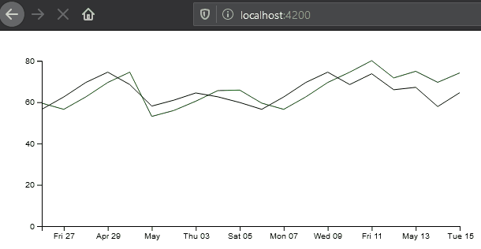

# virtual-market-angular

## Server

In the terminal navigate to the server folder and use 'node index.js' to start the express server that will deliver the generated data to the client.

## Client

In the terminal navigate to the 'angular-D3-chart' folder and use 'npm start' to start the client that will be at 'localhost:4200' in your browser.

This is a virtual market chart that is displaying data generated on an express server. The data is being fed by a Socket.io endpoint to the chart. 

I created this chart using a blog post over at https://auth0.com/blog/real-time-charts-using-angular-d3-and-socket-io/. I used this project to better understand how data could be "heard" by angular and displayed as readable information using d3 charts. This was a really fun way to extend my understanding of angular.

I needed to make a few changes in the code to make it run correctly and I also modified the way the data is generated to give it a more random feel.
 
